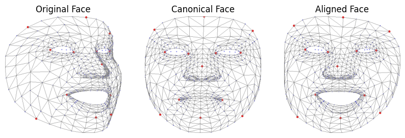

# Lightweight and Robust Face Emotion Recognition Using Landmarks

This project provides a lightweight, real-time facial emotion recognition (FER) system using facial landmarks. By leveraging Google’s MediaPipe framework for landmark extraction, the system employs deep learning models to classify emotions efficiently, making it ideal for mobile or resource-constrained environments.

### Key Features:
- Real-time processing
- Robust to extreme facial poses
- Efficient landmark-based deep learning models

# Repository Contents

### Python Scripts:

- **`data_collection.py`**: Script used to collect custom dataset for finetuning.
- **`utils.py`**: Utility functions for data handling, visualization, and landmark processing.

### Jupyter Notebooks:

- **`baseline-pretrain.ipynb`**: Pre-training a baseline model for emotion recognition.
- **`landmark-pretrain.ipynb`**: Pre-training a model based on facial landmarks.
- **`finetuning_and_evaluation.ipynb`**: Fine-tuning the models and evaluating performance.
